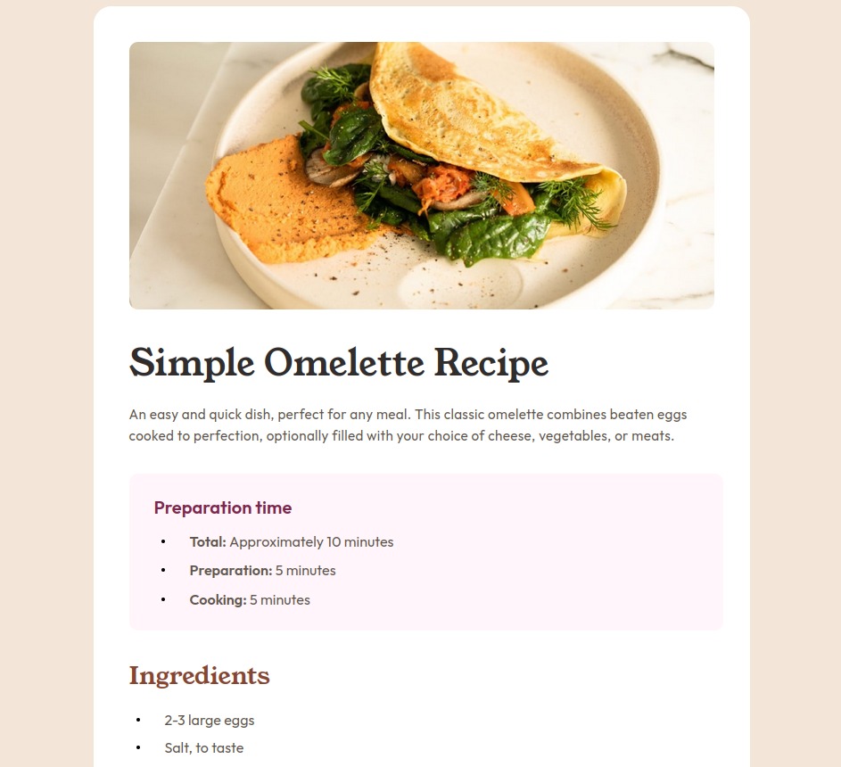
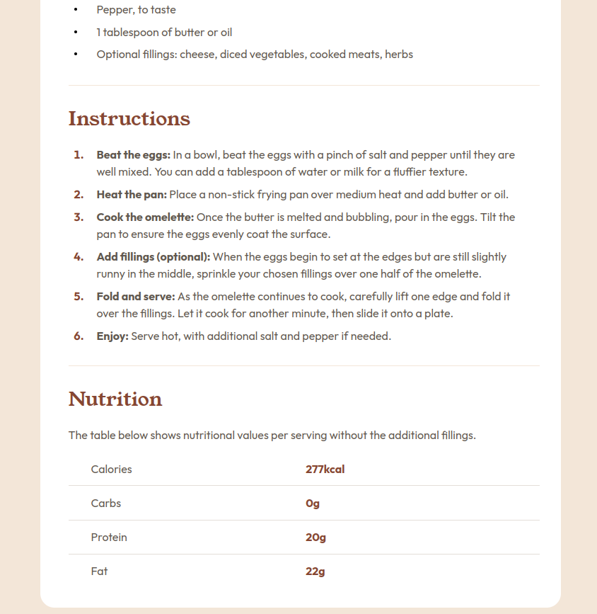

# Frontend Mentor - Recipe page solution

This is a solution to the [Recipe page challenge on Frontend Mentor](https://www.frontendmentor.io/challenges/recipe-page-KiTsR8QQKm). Frontend Mentor challenges help you improve your coding skills by building realistic projects. 

## Table of contents

- [Overview](#overview)
  - [Screenshot](#screenshot)
  - [Links](#links)
- [My process](#my-process)
  - [Built with](#built-with)
  - [What I learned](#what-i-learned)
  - [Continued development](#continued-development)
  - [Useful resources](#useful-resources)
- [Author](#author)
- [Acknowledgments](#acknowledgments)

## Overview

### Screenshot




### Links

- Solution URL: [https://github.com/harnettd/recipe-page-main](https://github.com/harnettd/recipe-page-main)
- Live Site URL: [https://harnettd.github.io/recipe-page-main/](https://harnettd.github.io/recipe-page-main/)

## My process

### Built with

- HTML
- CSS including Flexbox and CSS Grid
- Mobile-first workflow

### What I learned

I treated this project as a refresher exercise in HTML and CSS and didn't really need to learn new ideas or techniques. The one exception is the `::before` pseudoclass which I don't think that I've needed before. I used it to customize the markers of the unordered lists:  

```css
%vert-centred-bullet {
  flex-shrink: 0;
  content: "";
  margin-right: 2.8rem;
  width: 0.4rem;
  height: 0.4rem;
  border-radius: 50%;
}
```

### Continued development

I'd like to continue improving in the area of webpage responsiveness, particularly as it pertains to images.

### Useful resources

- [How can I vertically align a list item marker](https://stackoverflow.com/questions/69874236/how-can-i-vertically-align-a-list-item-marker#69874584) - This is the Stack Overflow post where I got the idea to use the `::before` pseudoclass to customize unordered list markers.

## Author

- Github - [harnettd](https://github.com/harnettd)
- Frontend Mentor - [@harnettd](https://www.frontendmentor.io/profile/harnettd)

## Acknowledgments

Thanks to [Frontend Mentor](https://www.frontendmentor.io/) for posting this challenge!
